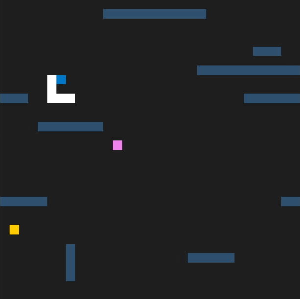

# CPPND: Capstone Snake Game

This is a repo for the Capstone project in the [Udacity C++ Nanodegree Program](https://www.udacity.com/course/c-plus-plus-nanodegree--nd213).

## Dependencies for Running Locally
* cmake >= 3.7
  * All OSes: [click here for installation instructions](https://cmake.org/install/)
* make >= 4.1 (Linux, Mac), 3.81 (Windows)
  * Linux: make is installed by default on most Linux distros
  * Mac: [install Xcode command line tools to get make](https://developer.apple.com/xcode/features/)
  * Windows: [Click here for installation instructions](http://gnuwin32.sourceforge.net/packages/make.htm)
* SDL2 >= 2.0
  * All installation instructions can be found [here](https://wiki.libsdl.org/Installation)
  >Note that for Linux, an `apt` or `apt-get` installation is preferred to building from source. 
* gcc/g++ >= 5.4
  * Linux: gcc / g++ is installed by default on most Linux distros
  * Mac: same deal as make - [install Xcode command line tools](https://developer.apple.com/xcode/features/)
  * Windows: recommend using [MinGW](http://www.mingw.org/)

## Basic Build Instructions

1. Clone this repo.
2. Make a build directory in the top level directory: `mkdir build && cd build`
3. Compile: `cmake .. && make`
4. Run it: `./SnakeGame`.

## Main Features Added
- Maps may be created using `data/map.txt`, with `1`s for Walls and `0`s for Air (blank space). The code is flexible to allow for simple addition of different object in the map with only slight refactoring.
- Map walls will shift horizontally and vertically over the course of the game.
- Food is modified to be either of the 'grow' or 'shrink' variety, each of which having the expected outcome on the snake. While increasing the score, shrink food will cause the snake to become shorter. Should a snake shrink when only a head, it will perish.
 - Each food consumed will increase the rate at which the walls will move. In addition, as more shrink food are consumed, the walls will increase in speed more drastically with each additional shrink food consumption.
 - To simplify this, speed adjustments to the snake upon consumption of any food have been removed in their entirety.

## Rubric Tasks

### Loops, Functions, I/O
- The project is neatly organized into functions and has a variety of control structures added.
- The project reads data from an external file as part of necessary operation (Map.cpp reads `data/map.txt` to generate a series of obstacles in the game).
- Project uses data structures and immutable variables
 - The project uses a variety of vectors throughout Map.cpp, and constant references in Renderer.cpp.

### OOP
- One or more classes are added to the project with appropriate access specifiers for class members (Map.cpp, see pub/private members).
- Classes abstract implementation details from their interfaces (the non-game functions of Map.cpp are abstracted into private members).
- Overloaded functions allow same function to operate on different parameters (SamePoint function in game.cpp is used in various ways to check coordinates against each other).

### Memory Management
- Project makes uses of references in function declarations (see additions in renderer.cpp to the Renderer function).
- The project follows the rule of 5 (Map may be moved freely, but copying is disallowed as for larger maps, this could become quite taxing. We wish to restrict this, in this case).
- Project uses move semantics to move data instead of copying where possible (Used in map.cpp to move and read lines when generating map data. All other functions in map.cpp act on the member data of the class itself, so do not use this approach).

### Concurrency
- Project uses multithreading -- a timer thread exists in game.cpp and upon its expiration the walls will shift vertically. After enough vertical movements, the walls will also shift horizontally.
- A mutex or lock is used to protect data shared across threads in the code.
- A condition variable is used in the project to synchronize thread execution -- A condition variable is used to avoid needless computation in the timer thread.

## CC Attribution-ShareAlike 4.0 International

Shield: [![CC BY-SA 4.0][cc-by-sa-shield]][cc-by-sa]

This work is licensed under a
[Creative Commons Attribution-ShareAlike 4.0 International License][cc-by-sa].

[![CC BY-SA 4.0][cc-by-sa-image]][cc-by-sa]

[cc-by-sa]: http://creativecommons.org/licenses/by-sa/4.0/
[cc-by-sa-image]: https://licensebuttons.net/l/by-sa/4.0/88x31.png
[cc-by-sa-shield]: https://img.shields.io/badge/License-CC%20BY--SA%204.0-lightgrey.svg
